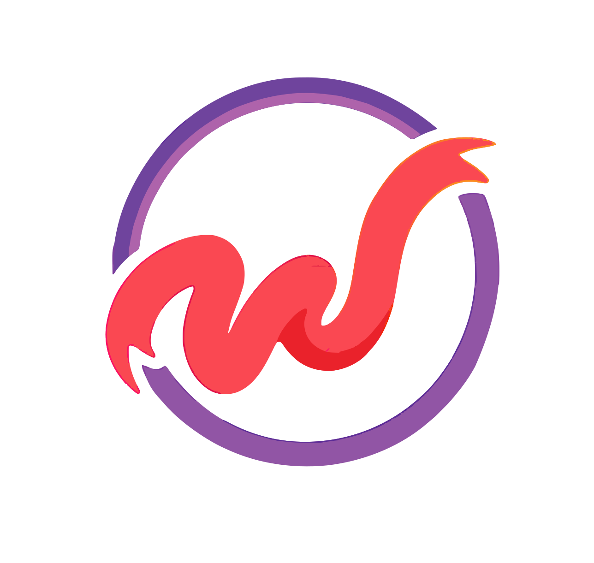
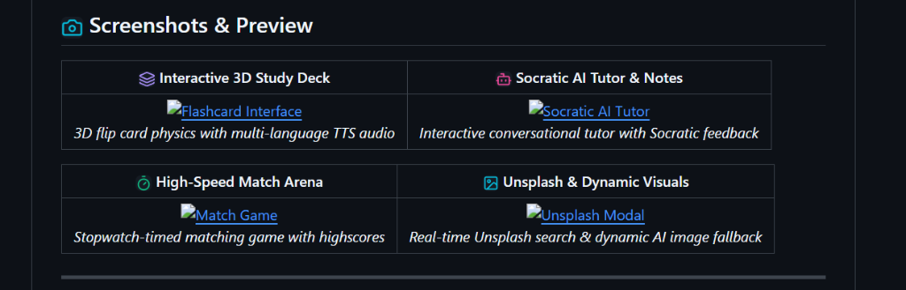
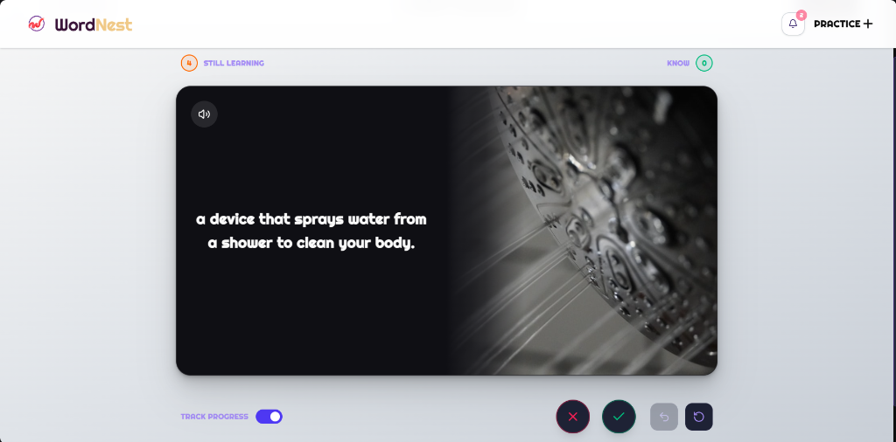
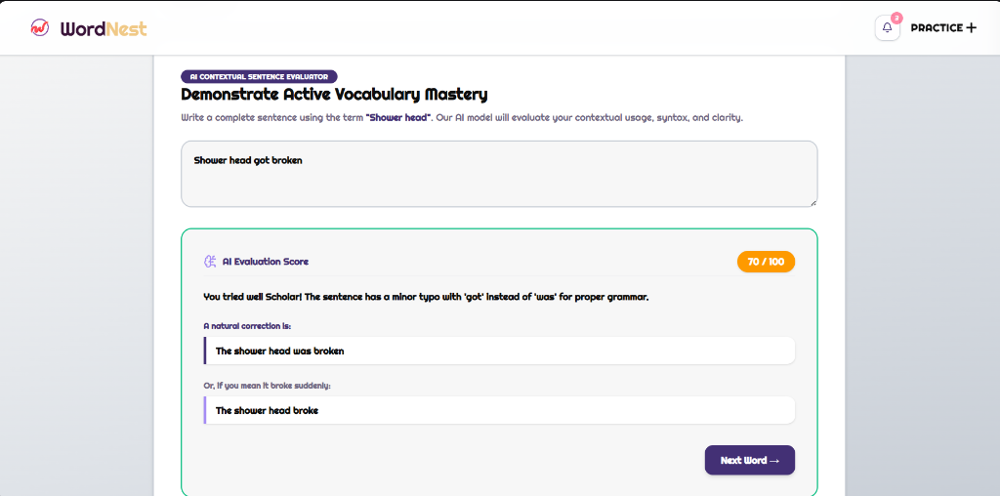
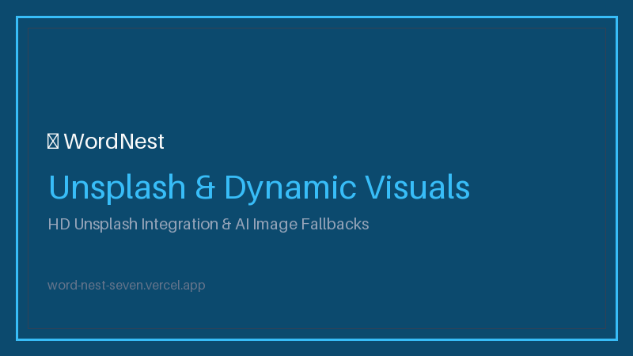

#  WordNest ⚡

[](https://github.com/Nagul55/WordNest)
[](LICENSE)
[](https://github.com/Nagul55/WordNest)
[](https://word-nest-seven.vercel.app)

---

### **A state-of-the-art Quizlet alternative powered by Groq AI (Llama 3.1) and Unsplash HD Visuals for intelligent, high-speed vocabulary mastery and interactive Socratic tutoring.**

[](https://word-nest-seven.vercel.app)

---

## 📑 Table of Contents
- [Why WordNest?](#-why-wordnest)
- [Screenshots \& Preview](#-screenshots--preview)
- [✨ Key Features](#-key-features)
- [🛠 Tech Stack](#-tech-stack)
- [⚡ Quick Start](#-quick-start)
- [📁 Project Structure](#-project-structure)
- [🔌 API Reference](#-api-reference)
- [🧪 Testing](#-testing)
- [🚀 Deployment](#-deployment)
- [🤝 Contributing](#-contributing)
- [📄 License](#-license)
- [👤 Author \& Contact](#-author--contact)

---

## 💡 Why WordNest?

Traditional flashcard platforms rely on manual input and static repetition, leading to study fatigue and inefficient learning. **WordNest** bridges this gap by combining **Socratic AI tutoring**, **instant AI deck generation from raw notes**, and **semantic sentence grading** into a sleek, ultra-responsive web platform designed for students and life-long learners.

---

## 📸 Screenshots & Preview

| 🃏 Interactive 3D Study Deck | 🤖 Socratic AI Tutor & Notes |
| :---: | :---: |
|  <br> *3D flip card physics with multi-language TTS audio* |  <br> *Interactive conversational tutor with Socratic feedback* |

| 🎯 High-Speed Match Arena | 🖼 Unsplash & Dynamic Visuals |
| :---: | :---: |
|  <br> *Stopwatch-timed matching game with highscores* |  <br> *Real-time Unsplash search & dynamic AI image fallback* |

---

## ✨ Key Features

| Icon | Feature Name | Description | Tech Used |
| :---: | :--- | :--- | :--- |
| 🎴 | **3D Realistic Flashcards** | Hardware-accelerated 3D flip card physics with Web Speech API multi-lingual TTS pronunciation and keyboard navigation (`Space`, `Arrows`). | Next.js, Framer Motion, Web Speech API |
| 🪄 | **AI Magic Notes Studio** | Converts raw lecture transcripts, essays, or notes into structured summary outlines, flashcards, and multiple-choice quizzes in seconds. | Groq Cloud (Llama 3.1), FastAPI, OpenAI SDK |
| 🎓 | **Socratic AI Tutor** | Conversational AI study assistant that quizzes students using the Socratic method to build intuitive conceptual understanding. | Groq Llama 3.1, Python AsyncIO |
| 🎯 | **Adaptive Learn Mode** | Spaced-repetition algorithm graduating terms from multiple choice to AI-graded written assessments based on student mastery. | TypeScript, FastAPI, Custom SM-2 Engine |
| ⚡ | **High-Speed Match Arena** | Time-trial tile matching game with real-time timers, personal best trackers, and celebratory confetti effects. | Canvas Confetti, Framer Motion |
| 🖼 | **Unsplash & Dynamic Visuals** | Instant HD photo assignment via Unsplash API with automatic fallbacks to Pollinations AI & LoremFlickr for 100% image coverage. | Unsplash API, HTTPX, Pollinations AI |
| 📁 | **Interactive 3D Folders** | Customized animated 3D folder decks that react dynamically to mouse position and hover states. | React Bits, Custom CSS 3D |
| 👤 | **Adaptive Student Persona** | Tailors AI vocabulary definitions, tone, and tutor analogies based on the student's age, username, and occupation. | Supabase Auth, Groq Prompt Engine |

---

## 🛠 Tech Stack

### **Frontend**


### **Backend**


### **Database & Authentication**


### **AI Services & APIs**


### **DevOps & Hosting**


---

## ⚡ Quick Start

### **Prerequisites**
- **Node.js**: `v18.0.0` or higher
- **Python**: `v3.10` or higher
- **Package Manager**: `npm` or `pnpm`
- **Accounts**: Supabase, Groq Cloud, Unsplash Developer

---

### **1. Repository Setup**
```bash
# Clone the repository
git clone https://github.com/Nagul55/WordNest.git

# Navigate to the workspace
cd WordNest
```

---

### **2. Database Setup (Supabase)**
1. Log into your [Supabase Dashboard](https://supabase.com) and create a new project.
2. Open the **SQL Editor** tab in Supabase.
3. Copy and run the initialization script from `supabase/schema.sql` to generate all tables, foreign keys, and RLS security policies.

---

### **3. Backend Installation & Setup**
```bash
# Navigate to the backend directory
cd backend

# Create a virtual environment
python -m venv venv

# Activate virtual environment
# Windows (PowerShell):
.\venv\Scripts\Activate.ps1
# macOS / Linux:
source venv/bin/activate

# Install Python dependencies
pip install -r requirements.txt
```

Create a `.env` file in the `backend/` directory using the reference below:

| Environment Variable | Description | Example / Required Value |
| :--- | :--- | :--- |
| `GROQ_API_KEY` | Groq Cloud API key for Llama 3.1 model inference | `gsk_...` |
| `UNSPLASH_ACCESS_KEY` | Unsplash Developer Access Key | `i764_...` |
| `SUPABASE_URL` | Supabase Project URL | `https://your-project.supabase.co` |
| `SUPABASE_KEY` | Supabase Service Role Key | `eyJ...` |

Launch the FastAPI backend server:
```bash
python run_server.py
```
*The backend API will run at `http://localhost:8000`. Interactive OpenAPI documentation is available at `http://localhost:8000/docs`.*

---

### **4. Frontend Installation & Setup**
```bash
# Open a new terminal tab and navigate to the frontend directory
cd frontend

# Install Node dependencies
npm install
```

Create a `.env.local` file in the `frontend/` directory using the reference below:

| Environment Variable | Description | Example / Required Value |
| :--- | :--- | :--- |
| `NEXT_PUBLIC_SUPABASE_URL` | Public Supabase API Endpoint | `https://your-project.supabase.co` |
| `NEXT_PUBLIC_SUPABASE_ANON_KEY` | Supabase Anonymous Client Key | `eyJ...` |
| `NEXT_PUBLIC_API_URL` | Backend REST Endpoint | `http://localhost:8000` |
| `NEXT_PUBLIC_UNSPLASH_KEY` | Public Unsplash Client Key | `i764_...` |

Launch the Next.js development server:
```bash
npm run dev
```
*Open `http://localhost:3000` in your browser to start studying with WordNest.*

---

## 📁 Project Structure

```bash
WordNest/
├── backend/                        # FastAPI Python Backend
│   ├── app/
│   │   ├── routers/                # REST API Routers
│   │   │   ├── ai.py               # AI Magic Notes & Socratic Tutor Router
│   │   │   └── unsplash.py         # Unsplash Search Router
│   │   ├── services/               # Core Service Layer
│   │   │   ├── ai_service.py       # Async Groq OpenAI Integration
│   │   │   ├── groq_service.py     # Prompt Engineering Engine
│   │   │   └── unsplash_service.py # Image API & Dynamic Fallback Service
│   │   └── config.py               # Environment Configuration Loader
│   ├── run_server.py               # Uvicorn FastAPI Entrypoint
│   └── requirements.txt            # Python Dependencies
├── frontend/                       # Next.js 16 App Router Frontend
│   ├── src/
│   │   ├── app/                    # App Router Pages & Styles
│   │   │   ├── globals.css         # Global Styles & Responsive Scrollbar Utilities
│   │   │   └── page.tsx            # Main Web Application Page
│   │   ├── components/             # React UI Component Hierarchy
│   │   │   ├── dashboard/          # Feature Views (Decks, Practice, Vault, Settings)
│   │   │   ├── StaggeredMenu.tsx   # Mobile Responsive Navigation Drawer
│   │   │   └── Folder.tsx          # 3D Animated Deck Folder Cards
│   │   └── lib/                    # API Clients & Utilities
│   │       ├── api.ts              # Frontend REST Service Client
│   │       └── supabase.ts         # Supabase Client Initialization
│   └── package.json                # Frontend Package Configuration
└── supabase/                       # Database Migrations & Schemas
    └── schema.sql                  # PostgreSQL Tables & RLS Policies
```

---

## 🔌 API Reference

### **AI Endpoints (`/api/ai`)**

| Method | Endpoint | Description | Request Body |
| :---: | :--- | :--- | :--- |
| `POST` | `/api/ai/magic-notes` | Converts raw study notes into full deck suite | `{ "content": "raw text...", "user_context": {} }` |
| `POST` | `/api/ai/definition` | Generates concise 1-sentence flashcard definition | `{ "word": "Hammer", "user_context": {} }` |
| `POST` | `/api/ai/tutor` | Socratic conversational tutoring stream | `{ "deck_title": "...", "cards": [], "messages": [] }` |
| `POST` | `/api/ai/grade` | Evaluates written student sentence for accuracy | `{ "term": "...", "expected_definition": "...", "user_response": "..." }` |

### **Visual Endpoints (`/api/unsplash`)**

| Method | Endpoint | Description | Query Parameters |
| :---: | :--- | :--- | :--- |
| `GET` | `/api/unsplash/search` | Fetches high-resolution images for vocabulary term | `q=Hammer&per_page=12` |

---

## 🧪 Testing

### **Frontend Verification & Production Build**
To test component rendering and type safety across all responsive viewports:
```bash
cd frontend
npm run build
```

### **Backend Endpoint Health Inspection**
Verify FastAPI service status by executing the automated endpoint verification suite:
```bash
cd backend
python -c "import urllib.request; print(urllib.request.urlopen('http://localhost:8000/docs').getcode())"
```

---

## 🚀 Deployment

### **Frontend (Vercel)**
The frontend is pre-configured for instant one-click deployment on Vercel:
1. Connect your GitHub repository to [Vercel](https://vercel.com).
2. Set the **Root Directory** to `frontend`.
3. Add `NEXT_PUBLIC_SUPABASE_URL`, `NEXT_PUBLIC_SUPABASE_ANON_KEY`, `NEXT_PUBLIC_API_URL`, and `NEXT_PUBLIC_UNSPLASH_KEY` under **Environment Variables**.
4. Deploy!

### **Backend (Render / Railway)**
1. Create a new **Web Service** on [Render](https://render.com).
2. Set the **Root Directory** to `backend`.
3. Set the **Build Command** to `pip install -r requirements.txt`.
4. Set the **Start Command** to `python run_server.py` or `uvicorn app.main:app --host 0.0.0.0 --port $PORT`.

---

## 🤝 Contributing

Contributions are what make the open-source community an incredible place to learn, inspire, and create. Any contributions you make are **greatly appreciated**.

1. Fork the Project (`git checkout -b feature/AmazingFeature`)
2. Create your Feature Branch (`git checkout -b feature/AmazingFeature`)
3. Commit your Changes (`git commit -m 'Add some AmazingFeature'`)
4. Push to the Branch (`git push origin feature/AmazingFeature`)
5. Open a Pull Request

---

## 📄 License

Distributed under the **MIT License**. See `LICENSE` for more information.

---

## 👤 Author & Contact

**Nagul G**  
Full-Stack Developer & AI Systems Architect

- 🌐 **Live Application**: [WordNest Web App](https://word-nest-seven.vercel.app)
- 🐙 **GitHub**: [@Nagul55](https://github.com/Nagul55)
- 💼 **LinkedIn**: [nagul-g](https://www.linkedin.com/in/nagul-g)
- 🐦 **Twitter**: [@Nagul_55](https://x.com/Nagul_55)

---

<p align="center">
  Made with ❤️ for students worldwide by Nagul G. If you find WordNest helpful, please give it a ⭐ on GitHub!
</p>
